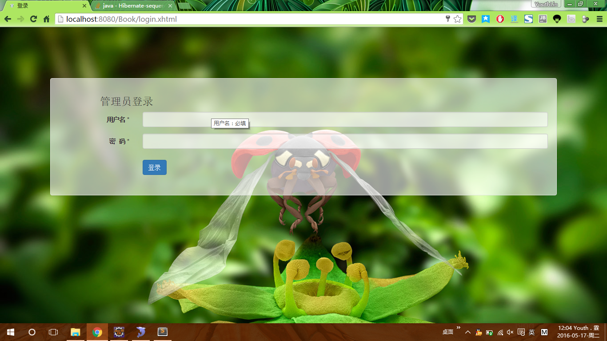
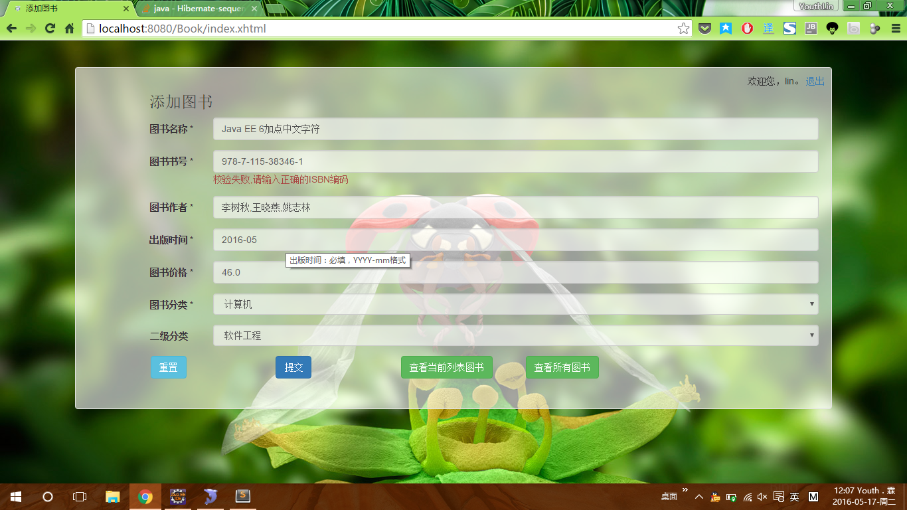
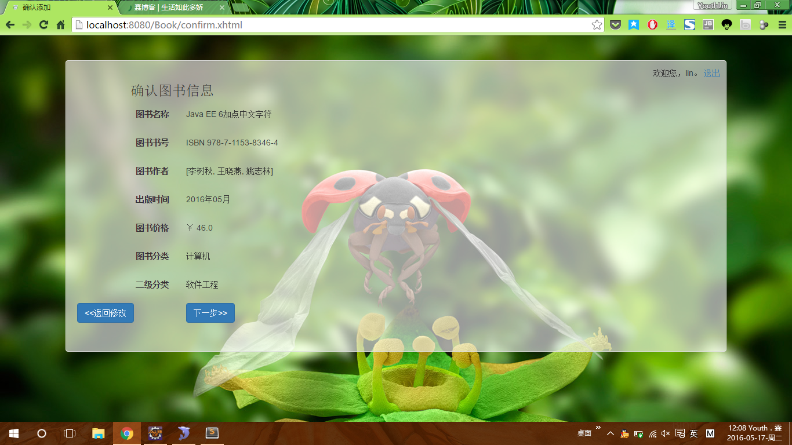
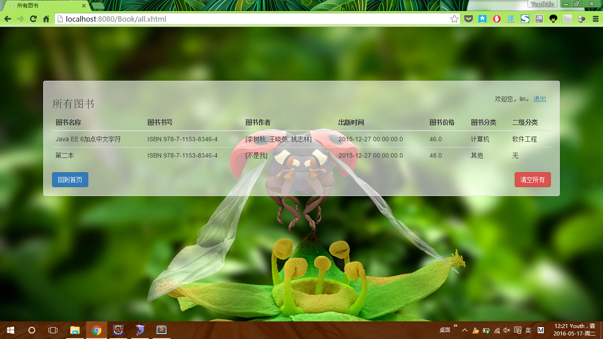
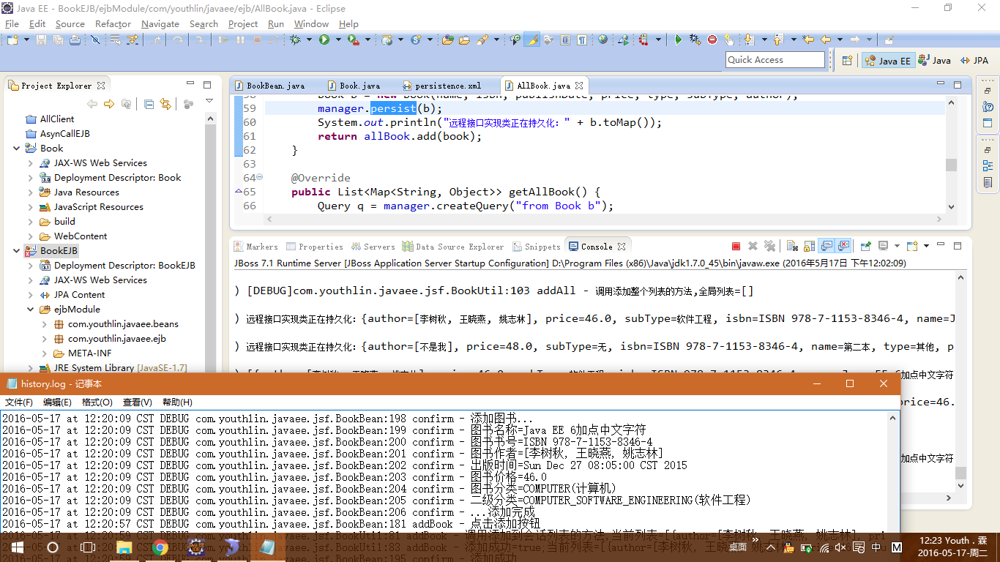
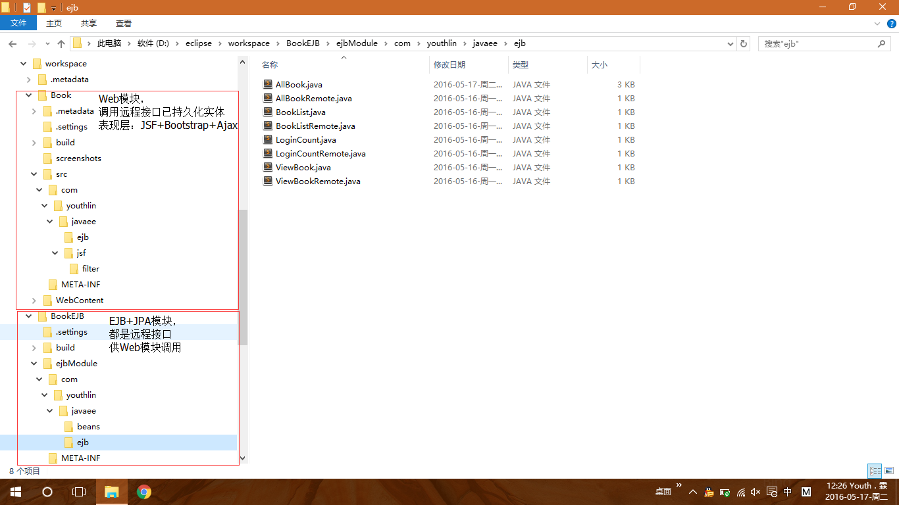

# Library-with-JSF-EJB-JPA
a Demo for Java EE / JSF / EJB / JPA (其实是《软构件与中间件技术》课程的实验)

## 实验要求
见[题目](题目.txt)

## 介绍
`Book` 文件夹是 Web 模块，使用 JSF 作为表现层技术，实现图书的添加功能，并能够使用自定义校验器/转换器以及级联菜单。
`BookEJB` 文件夹是 EJB + JPA 模块，EJB 均为实现远程接口的会话Bean. 分为 Stateless Session Bean(用于查询所有图书), Stateful Session Bean(用于保存每个会话的临时图书列表，并添加该列表到数据库中), Singleton Session Bean(用于记录管理员登录次数). JPA 部分仅采用最简单的单表，持久化Book类。

## 截图
请见 `Book` 文件夹的 `screenshots` 文件夹。

1. 登录

2. AddBookForm添加图书表单

3. AddBookFormValidator添加图书表单校验

4. 确认信息

5. 临时会话列表

6. AddListToDB添加临时列表到数据库

7. LOG控制台及文件日志

8. Saved数据库中已保存

9. 项目结构

