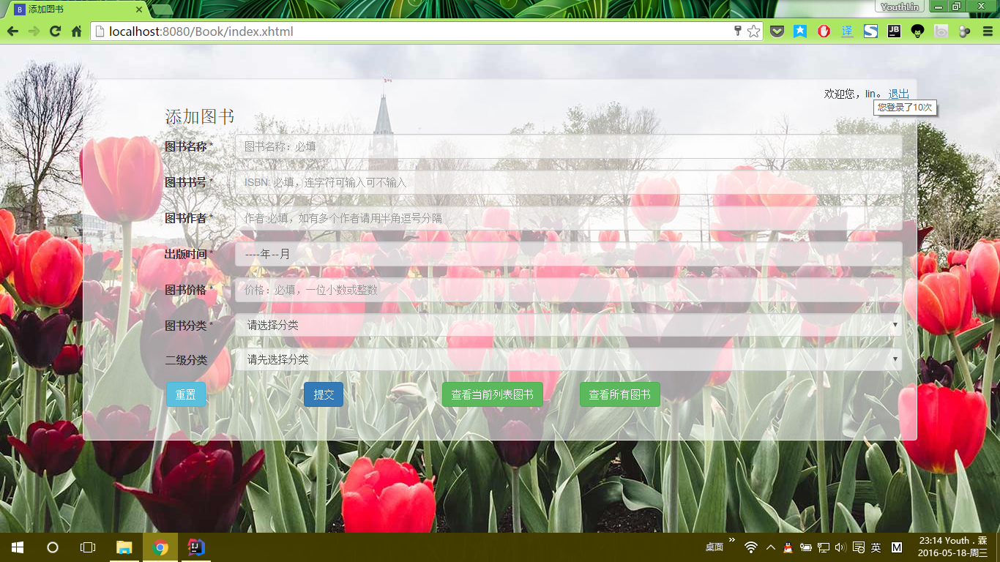
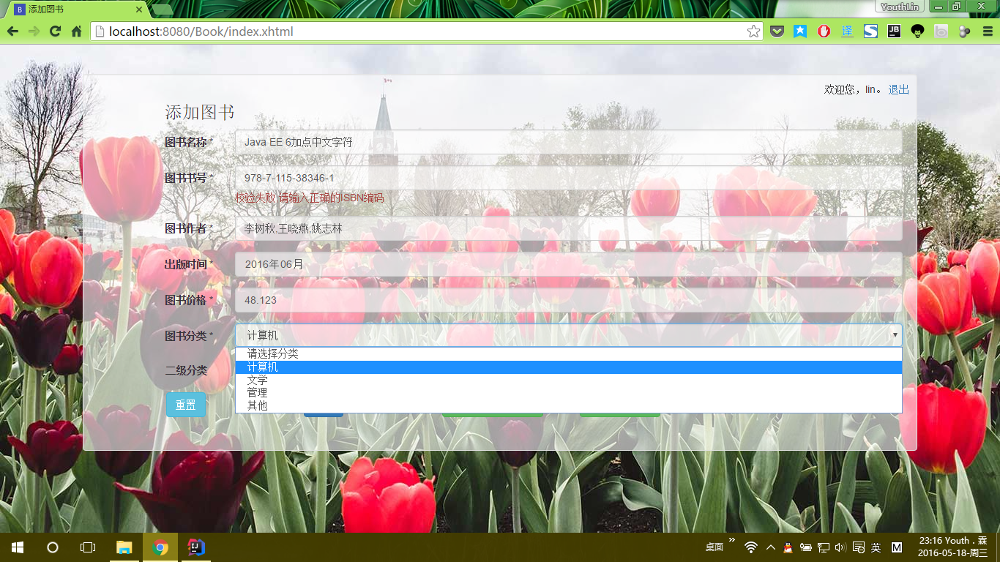
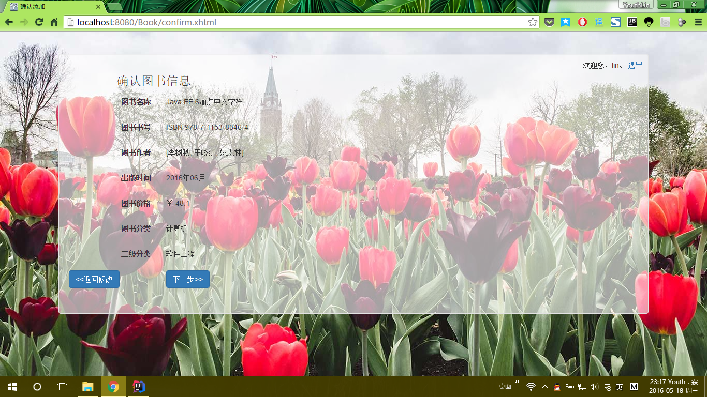
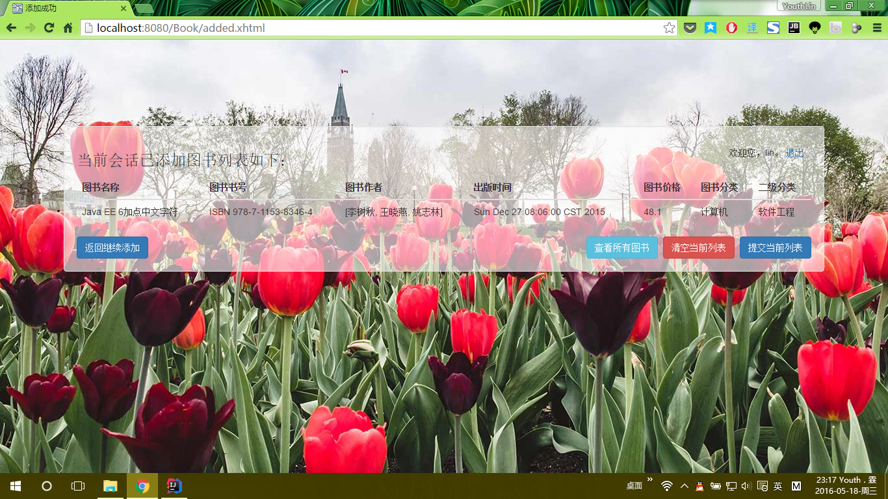

# Library-with-JSF-EJB-JPA
a Demo for Java EE / JSF / EJB / JPA (其实是《软构件与中间件技术》课程的实验)  

原来是 Eclipse + JBoss7.1 + JDK7 现已迁移到 IDEA + WildFly10 + JDK8  

## 需求
见 [题目.txt](题目.txt)  

## 简介
<pre>
./
├─BookEJB                                                   * EJB + JPA 模块*
│  │  BookEJB.iml
│  │
│  ├─META-INF
│  │      ejb-jar.xml
│  │      persistence.xml                                   *持久化配置文件*
│  │
│  └─src
│      └─com
│          └─youthlin
│              └─javaee
│                  ├─beans
│                  │      Book.java                         *实体类*
│                  │
│                  └─ejb
│                          AllBook.java
│                          AllBookRemote.java               *管理所有图书信息，与数据库交互*
│                          BookList.java
│                          BookListRemote.java              *管理会话 scope 临时的列表*
│                          LoginCount.java
│                          LoginCountRemote.java            *单例会话 Bean, 记录登录次数*
│                          ViewBook.java
│                          ViewBookRemote.java              *获取所有图书信息*
│
├─lib                                                       * IDEA 自动下载的库文件，应设置为Provide*
│      javax.annotation.jar
│      javax.jms.jar
│      javax.persistence.jar
│      javax.resource.jar
│      javax.servlet.jsp.jstl.jar
│      javax.transaction.jar
│
├─src
│  │  admin.properties                                      *存放管理员用户名及密码*
│  │  jboss-ejb-client.properties                           *与 EJB 交互配置文件*
│  │  log4j2.xml                                            * log4j 配置*
│  │
│  ├─com
│  │  └─youthlin
│  │      └─javaee
│  │          ├─ejb                                         *所有远程接口*
│  │          │      AllBookRemote.java
│  │          │      BookListRemote.java
│  │          │      LoginCountRemote.java
│  │          │      TestClient.java
│  │          │      ViewBookRemote.java
│  │          │
│  │          └─jsf
│  │              │  AdminBean.java                         *管理员登录登出*
│  │              │  AuthorConverter.java                   *字符串到列表的转换器*
│  │              │  BookBean.java                          *表单*
│  │              │  BookUtil.java                          *工具类*
│  │              │  MyLog.java                             *同上*
│  │              │  SUBTYPE.java                           *二级菜单，枚举类*
│  │              │  TYPE.java                              *以及菜单，枚举类*
│  │              │
│  │              └─filter
│  │                      LoginCheckFilter.java             *登录过滤器*
│  │                      SetCharacterEncodingFilter.java   *字符编码转换过滤器*
│  │
│  └─META-INF
└─web
    │  added.xhtml                                          *临时列表页*
    │  all.xhtml                                            *所有信息页*
    │  confirm.xhtml                                        *确认信息页*
    │  index.xhtml                                          *表单填写页*
    │  login.xhtml                                          *管理登录页*
    │
    ├─dist
    │  ├─css
    │  │      bootstrap-theme.css
    │  │      bootstrap-theme.css.map
    │  │      bootstrap-theme.min.css                       *增加了 body 背景，.well, .form-control 的透明度*
    │  │      bootstrap.css
    │  │      bootstrap.css.map
    │  │      bootstrap.min.css
    │  │
    │  ├─fonts
    │  │      glyphicons-halflings-regular.eot
    │  │      glyphicons-halflings-regular.svg
    │  │      glyphicons-halflings-regular.ttf
    │  │      glyphicons-halflings-regular.woff
    │  │      glyphicons-halflings-regular.woff2
    │  │
    │  └─js
    │          bootstrap.js
    │          bootstrap.min.js                             *增加了使居中效果*
    │          jquery-2.1.4.min.js
    │
    └─WEB-INF
        │  faces-config.xml                                 *页面跳转规则*
        │  web.xml                                          *不解释*
        │
        └─lib
                jboss-client.jar                            *与 EJB 交互必须的文件*
                log4j-api-2.5.jar
                log4j-core-2.5.jar
                log4j-web-2.5.jar
</pre>

## 截图

1. 登录页  
     
2. 表单页  
     
3. 表单校验+级联菜单  
     
4. 确认页  
     
5. 会话临时列表  
     
6. 提交列表转到所有图书信息  
     

## 注意事项
JPA 模块使用的是 JNDI 数据源，需要事先配置 JBoss 的数据源。

## About
[@Youth．霖](http://youthlin.com/)
